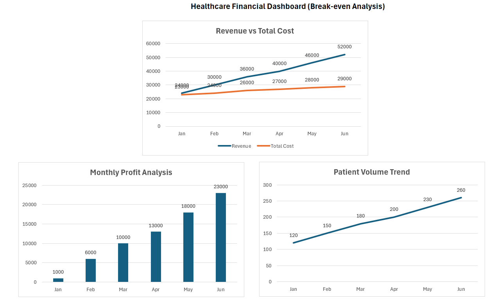

# Healthcare Financial Dashboard (Break-even Analysis)

## Overview
This project analyzes healthcare clinic financial performance to identify the break-even point and evaluate profitability trends over time.

---

## Problem Statement
Healthcare clinics need to understand when revenue covers costs and how patient volume impacts profitability for better operational planning.

---

## Tools & Technologies
- Excel  
- Financial Analysis  
- Data Visualization  

---

## Methodology
- Calculated total costs (fixed + variable)
- Compared revenue vs total cost across months
- Analyzed profit trends over time
- Evaluated patient volume impact on financial performance

---

## Key Insights
- Break-even point achieved between February and March  
- Profit increases steadily with patient volume  
- Higher patient volume leads to improved financial outcomes  

---

## Dashboard

---

## Business Impact
- Helps healthcare clinics determine profitability thresholds  
- Supports financial planning and cost optimization  
- Enables data-driven operational decisions  

---

## Author
Vinay Kumar Thota
